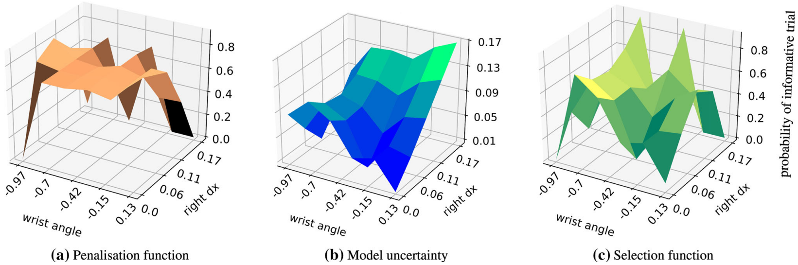
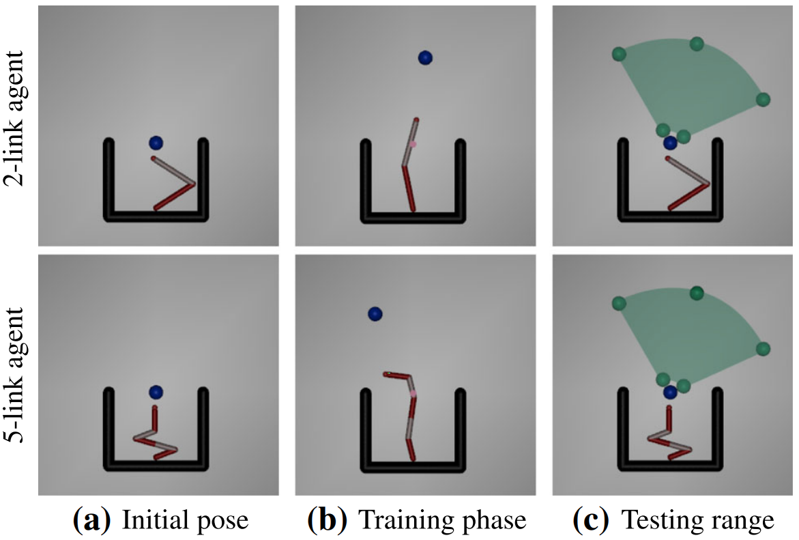
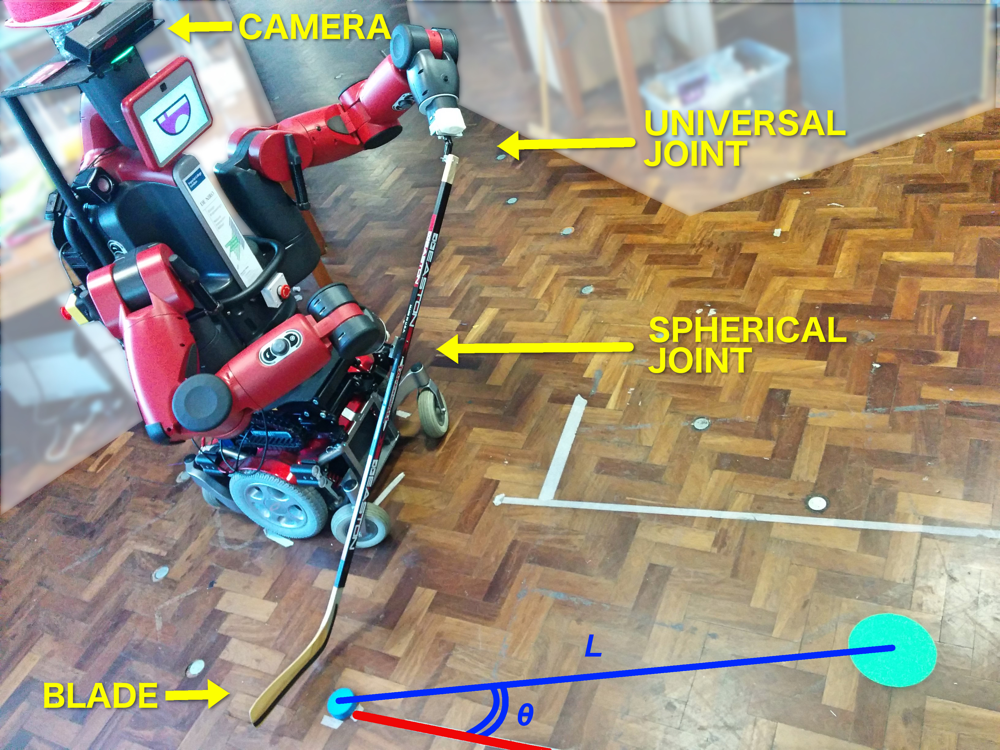

# Informed Search

Informed Search of the movement parameter space, that gathers most informative
samples for fitting the forward model.

[Full paper](https://link.springer.com/article/10.1007%2Fs10514-019-09842-7)

[Project website](https://sites.google.com/view/informedsearch)


## Motivation and Method Description

The main goal is to build an invertible forward model 
(maps movement parameters to trial outputs) by fitting a Gaussian Process Regression model
to the movement parameter space.
The forward model can be used at test time to generate the appropriate parameters 
to achieve a desired trial output.
Model learning requires a set of {movement parameter, trial outcome} pairs, 
where each trial is costly to evaluate.
To increase efficiency, it is necessary to explore the movement parameter space in as few 
trials as possible. 

This is done by evaluating only the potentially most informative regions of the parameter space.
Informed Search uses three functions defined over the parameter space.
The selection function gives us the most informative regions at each trial iteration. 

<p align="center">
   
</p>


## Experiments

The approach has been evaluated in simulation on a puck striking task, 
as well as on the real dual-arm hockey-playing robot.


Simulation Experiment | Robot Experiment |
:-------------------------:|:-------------------------:|
 |  

---


# Using the code


__Prerequisites:__ Conda, Python 3, MuJoCo licence


##  Installation

Navigate to the base installation directory where to download the repository:
```
cd <INSTALL_PATH>
```


Download repository:

```
git clone https://github.com/nemanja-rakicevic/informed_search.git
cd informed_search

export $INFOSEARCH_PATH=$(pwd)

```


Sync to latest repo (*This will overwrite any local untracked changes!*):

`git fetch --all; git reset --hard origin/master`


Set up Conda environment with all dependencies:

```
conda env create -f infosearch_env.yml

conda activate infosearch_env

```

Install repository:

`pip install -e . ; python setup.py clean`

This automatically adds `$INFOSEARCH_PATH` to `$PYTHON_PATH`.


##  Training

In order to perform the training, it is necessary to chose the environment 
(striker_2_link or striker_5_link), 
and the algorithm to run (informed, random, uidf, bo and entropy).
<!-- The config files for striker_2_link contain default values corresponding to 
the experiments presented in figure 6b in the original
[paper](https://link.springer.com/article/10.1007%2Fs10514-019-09842-7)]. -->
Other arguments are optional. For more information refer to the code.

```
cd $INFOSEARCH_PATH

python main_training.py --config_file configs/{striker_2_link, striker_5_link}/paper_{informed, random, uidf, bo, entropy}.json
```

An example of a basic usage that runs a 2-link striker simulated experiment with the 
proposed informed search algorithm:
```
python main_training.py --config_file configs/striker_2_link/paper_informed.json
```


##  Load saved models

Evaluate the learned model from a specified path, on the whole test set:
```
python analysis/evaluate_test_full.py --load <path to experiment directory>
```

Check performace of the loaded model for specific test target positions:
```
python analysis/evaluate_test_target.py --load <path to experiment directory>
```


---

# Reference
```
@Article{Rakicevic2019informed,
         title="Active learning via informed search in movement parameter space for efficient robot task learning and transfer",
         author="Rakicevic, Nemanja and Kormushev, Petar",
         journal="Autonomous Robots",
         year="2019",
         month="Feb",
         day="21",
         issn="1573-7527",
         doi="10.1007/s10514-019-09842-7",
         url="https://doi.org/10.1007/s10514-019-09842-7"
}
```
